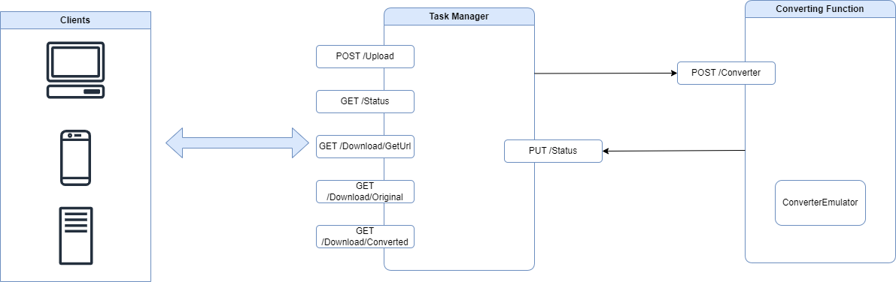
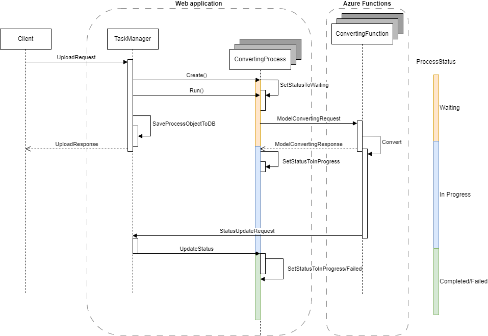
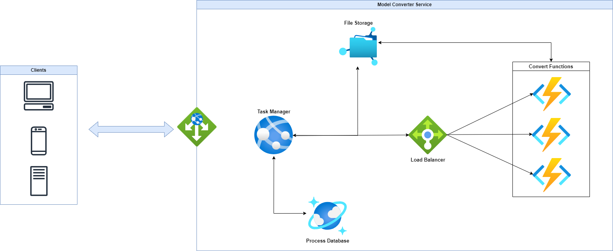

# Model Converter

## Architecture



## Model converting flow



#### UploadRequest

This request contains exactly one `.shapr` file and and in the in the form it contains a `body` key with the following JSON

```json
{
    "TargetFormat" : "step" //possible values: step, iges, stl, obj
}
```

#### Endpoint

`POST <TaskManagerUrl>/api/Upload`

When the `TaskManager` received and validated the request, it saves the file locally, where other services also can reach. In a real life application this place would be a file-share, a database or any cloud storage. After file saved it creates a `Process` object. With this we can follow the status of the converting process. These process objects are saved into a in-memory storage. In a real life application these data would be also saved to a database or any cloud storage.
After the `Process` object is saved to the storage and started the `TaskManager` returns with a `UploadResponse` to the client

#### UploadResponse

```json
{
    "ProcessId" : "1f317f01-2973-4bd6-b351-f784ba0a4f26", //the id of the created process
    "ProcessStatusUrl" : "<TaskManagerUrl>/api/Status?processId=1f317f01-2973-4bd6-b351-f784ba0a4f26" //the url where the client can check the status of the process
}
```

The `Process` object initiated with the status `Waiting`. During the running of this process it calls the endpoint of the `ConverterFunction`.

#### ModelConvertingRequest

```json
{
   "InputPath" : "C:/Input/1f317f01-2973-4bd6-b351-f784ba0a4f26.shapr", //the file saved by TaskManager
    "OutputPath" : "C:/Output", //the path where the converted file should be saved
    "TargetFormat" : "stl" //the target format, possible values: step, iges, stl, obj
}
```

#### Endpoint

`POST <ConverterService>/api/Convert`

After `ConvertingFunction` validates the request, it start the conversion in the background. After conversion starts the `ConvertingFunction` sends back to `TaskManager` a `ModelConvertingResponse`

#### ModelConvertingResponse
 
```json
 {
    "ProcessId" : "1f317f01-2973-4bd6-b351-f784ba0a4f26",
    "ProcessStartResult" : "Started" //the result of starting the process in ConvertingFunction, possible values: Started/Failed
 }
```
 
 When thi request received by the 'TaskManager' it updates the status of the `Process` to `In-Progress` if the result is `Started` else it will be `Failed`.

At this point the `Process` object "sitting" in the storage with the status of `In-Progress`. When the `ConvertingFunction` finishes or fails the conversion, it sends a `StatusUpdateRequest` to the `TaskManager`.

#### StatusUpdateRequest

```json
{
    "ProcessId" : "1f317f01-2973-4bd6-b351-f784ba0a4f26",
    "OutputPath" : "C:/Output/new_1f317f01-2973-4bd6-b351-f784ba0a4f26.obj", //the path of the converted file, can be empty when process failed
    "Status" : "Completed" //status of the process
}
```

The `TaskManager` updates the status of the process in the "database" and set the `OutputPath` on it when it completed successfully.

## Process Status Checking

To check the status of the `Process` the client need to call the following endpoint.

#### Endpoint

`GET <TaskManagerIp>\api\Status?processId=1f317f01-2973-4bd6-b351-f784ba0a4f26`

The `TaskManager`, after validates the incoming id, look for the `Process` object int the process pool and returns with the value of the status property in the following format.

#### ProcessStatusResponse

```json
{
    "ProcessId" : "1f317f01-2973-4bd6-b351-f784ba0a4f26",
    "ProcessStatus" : "In-Progress" //possible values: Waiting, In-Progress, Completed, Failed
}
```
## Downloading The Completed Files

If the client sees that the process status is `Completed`, then with the following call it could get the download URLs. If the process is still running the client will get HTTP 404.

#### Endpoint

`GET <TaskManagerIp>/api/Download/GetUrl?processId=1f317f01-2973-4bd6-b351-f784ba0a4f26`

This endpoint will generate the URLs from where the original and the converted files can be downloaded.

#### DownloadResponse

```json
{
    "ProcessId" : "1f317f01-2973-4bd6-b351-f784ba0a4f26",
    "OriginalFileUrl" : "<TaskManagerIp>/api/Donwload/Original?processId=1f317f01-2973-4bd6-b351-f784ba0a4f26",
    "ConvertedFileUrl" : "<TaskManagerIp>/api/Donwload/Converted?processId=1f317f01-2973-4bd6-b351-f784ba0a4f26"
}
```

On theses endpoint the `TaskManager` validates that the files exist and checks that the `Process` finished successfully. If everything is completed the `TaskManager` sends back the desired file.

## Deployment Plan



In my previous projects I have worked most with Azure, so this is the reason I choose this provider. Of course in AWS we can find components with the same functionality. To deploy the following services and components we don't need to spend hours on Azure Portal but we can use IoC. Most of the cloud platform provide some template or solution for this problem, but there are common solutions as well, like Terraform.

### Azure App Service

For `TaskManager` I would choose an Azure App Service, because it provides us a serverless platform for us, so we don't need to maintain physical or virtual machines. Beside maintenance, App Service could form to the actual demand. So when there is a higher load on the system it allow and can use more resources (CPU, memory), but in a calm period theses resources could be released.

### Azure Functions

For the `ConvertingFunction` I would choose the Azure Functions. It is totally serverless also. These are event driven functions, in this case triggered by HTTP calls. So they consume resources when they are running. They can handle high load as well, because these functions running totally separated, so they do not disturb or consume resource from each other.

### Load Balancer

With a simple load balancer before the Azure Functions we are able to control the concurrently running process.

### Cosmos DB

To store the objects of `Process` with the related properties I would choose the Cosmos DB, which is a No-SQL database. We can easily store our simple data structure in this DB. It is reliably, we could have copies (in other regions as well) and regular backups.

### File Share

To store the uploaded and converted files I would choose a simple Azure File Share. It provides us a serverless file storage with high availability and responsibility.

### Azure App Gateway

To protect our application from the internet, an App Gateway is a must have. We need to filter our traffic, and allow access only for trusted services.

This would be one from many possible deployment plan. We could move to Docker and Kubernetes direction, or we could try out some virtual machine instead of PaaS solutions.

## Conclusion

There is a [postman](../Postman/) folder with a Postman collection and global variable in the repository. After importing them to Postman you can try out the application.
`IMPORTANT: C:\Temp\Input and C:\Temp\Output folders need to exist!`
There are several projects in the solution, you need to run the followings:
 - ModelConverter.ConvertingFunctions
 - ModelConverter.TaskManager

There are also some tets projects, but I had time only for few test cases. Of course a real life application need to covered with unit, integration and E2E tests.
